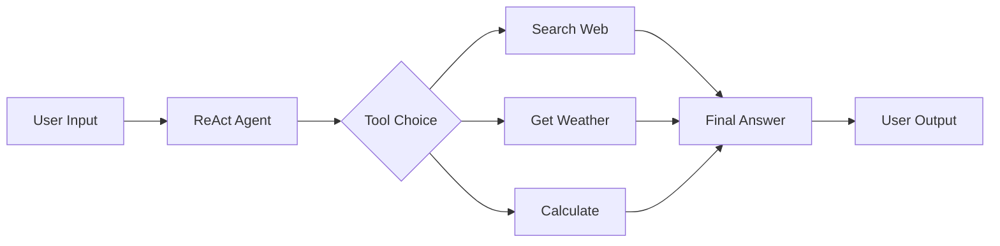
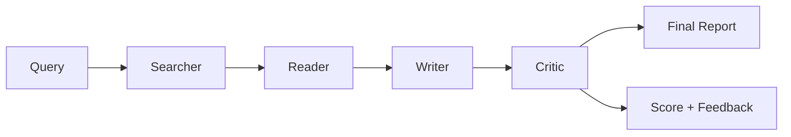

# 🤖 AI Agent Systems

A repository containing two production-grade AI agent systems built with LangChain, Streamlit, and modern LLMs.

## 📁 Repository Structure

```

tool-calling-agent/
├── app.py                          # Project 2: Single-Agent System
├── core/                           # Project 2 core engine
├── skills/                         # Project 2 skills
├── project_3_multi_agent/          # Project 3: Multi-Agent System
│   ├── app.py                      # Multi-Agent Streamlit UI
│   ├── core/                       # Multi-Agent core
│   ├── agents/                     # Specialized agents
│   └── requirements.txt
└── README.md

```

---

## 🚀 Project 2: Single-Agent Tool Calling System

**Live Demo:** [Single-Agent System](https://tool-calling-agent-5cgnuhafkdl2munkctttaj.streamlit.app/) 

A ReAct-based autonomous agent that can:
- 🔍 **Search the web** using Tavily API
- 🌤️ **Get weather information** for any location
- 🧮 **Perform mathematical calculations** safely

### Key Features
- **LangGraph ReAct Agent** with tool-calling capabilities
- **Streamlit UI** with chat interface
- **Cached agent** for efficient performance
- **System instruction injection** with current date context

### Tech Stack
- LangChain + LangGraph
- Mistral AI (mistral-small-latest)
- Tavily Search API
- Streamlit

---

## 🧠 Project 3: Multi-Agent Research System

**Live Demo:** [Multi-Agent Research System](https://multi-agent-researchers.streamlit.app/)

A sophisticated multi-agent pipeline that researches, synthesizes, and improves information using four specialized agents.

### Agent Pipeline

```

🔍 Searcher → 📖 Reader → ✍️ Writer → 🎯 Critic

```

| Agent | Role | Tools Used |
|-------|------|------------|
| **Searcher** | Finds relevant sources | Tavily Search API |
| **Reader** | Extracts content from URLs | BeautifulSoup4, Requests |
| **Writer** | Synthesizes research into a report | Mistral AI (LCEL) |
| **Critic** | Reviews, scores, and improves the report | Mistral AI (LCEL) |

### Key Features
- **Sequential state passing** using LangChain Expression Language (LCEL)
- **Automated quality scoring** (1-10 scale)
- **Feedback loop** with revision capability
- **Full observability** with per-agent execution logs
- **Multi-tab UI** showing every stage of the pipeline

### Tech Stack
- LangChain + LCEL
- Mistral AI
- Tavily Search API
- BeautifulSoup4 (web scraping)
- Streamlit

---

## 🛠️ Installation & Setup

### Prerequisites
- Python 3.9+
- API Keys:
  - [Mistral AI API Key](https://console.mistral.ai/)
  - [Tavily API Key](https://tavily.com/)

### Local Development

1. **Clone the repository**
```bash
git clone https://github.com/Moskowdigama/tool-calling-agent.git
cd tool-calling-agent
```

2. Set up a virtual environment (recommended)

```bash
python -m venv venv
source venv/bin/activate  # On Windows: venv\Scripts\activate
```

3. Install dependencies

For Project 2 (Single-Agent):

```bash
pip install -r requirements.txt
```

For Project 3 (Multi-Agent):

```bash
pip install -r project_3_multi_agent/requirements.txt
```

4. Set up environment variables
   Create a .streamlit/secrets.toml file:

```toml
MISTRAL_API_KEY = "your-mistral-api-key"
TAVILY_API_KEY = "your-tavily-api-key"
```

Running Locally

Project 2:

```bash
streamlit run app.py
```

Project 3:

```bash
streamlit run project_3_multi_agent/app.py
```

---

☁️ Deployment to Streamlit Cloud

Both projects are deployed separately on Streamlit Cloud.

Deploy Project 2 (Single-Agent)

1. Go to Streamlit Cloud
2. Click "New app"
3. Select repository: Moskowdigama/tool-calling-agent
4. Branch: main
5. Main file path: app.py
6. Add secrets (Settings → Secrets):

```toml
MISTRAL_API_KEY = "your-mistral-api-key"
TAVILY_API_KEY = "your-tavily-api-key"
```

7. Click Deploy

Deploy Project 3 (Multi-Agent)

1. Go to Streamlit Cloud
2. Click "New app"
3. Select repository: Moskowdigama/tool-calling-agent
4. Branch: main
5. Main file path: project_3_multi_agent/app.py
6. Add secrets (same as above)
7. Click Deploy

---

🔑 API Keys Setup

Mistral AI

1. Sign up at Mistral AI Console
2. Generate an API key
3. Add to Streamlit secrets or .streamlit/secrets.toml

Tavily

1. Sign up at Tavily
2. Get your API key from the dashboard
3. Add to Streamlit secrets or .streamlit/secrets.toml

---

📊 Project Architecture

Project 2: Single-Agent Flow



Project 3: Multi-Agent Flow



---

🧪 Usage Examples

Project 2: Single-Agent

```
User: "What's the weather in Tokyo today?"
Agent: *Calls weather tool* → "Tokyo is 22°C with light rain"
```

```
User: "Calculate 15 * 23 + 100"
Agent: *Calls calculator* → "445"
```

Project 3: Multi-Agent

```
User: "What are the latest advancements in AI-powered robotics?"
Searcher: Finds 5 relevant sources
Reader: Extracts content from URLs
Writer: Synthesizes a comprehensive report
Critic: Scores 8/10 and provides improvements
```

---

🛣️ Roadmap

☑ Single-Agent Tool Calling System
☑ Multi-Agent Research System
☐ Multi-Agent with LangGraph (loops + conditional routing)
☐ Human-in-the-loop gates
☐ Memory/persistence layer

---

🤝 Contributing

This is a personal project, but suggestions and feedback are welcome! Feel free to open issues or submit PRs.

---

📝 License

MIT License - feel free to use and modify.

---

👨‍💻 Author

Built by Shanky as part of the GenAI Engineer learning path.

---

🙏 Acknowledgements

· LangChain
· Mistral AI
· Tavily
· Streamlit


